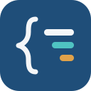

<div align="center">



# Python for .NET Engineers

*Reading, writing and shipping Python when C# is your first language.*

**Python dla inżynierów .NET** — *Czytanie, pisanie i wdrażanie Pythona,
gdy C# jest twoim pierwszym językiem.*

[](https://konradcinkusz.github.io/python-for-csharp-developers/Python-for-dotNET-Engineers.pdf)
[](https://konradcinkusz.github.io/python-for-csharp-developers/Python-dla-inzynierow-dotNET.pdf)

[](https://github.com/konradcinkusz/python-for-csharp-developers/actions/workflows/build.yml)
[](https://github.com/konradcinkusz/python-for-csharp-developers/actions/workflows/pages.yml)
[](LICENSE)
[](LICENSE-CONTENT)

</div>

Both editions are built from one source and republished on every push to
`main`, so the two PDFs above are the current state of this repository
rather than a snapshot somebody remembered to upload. The
[summary page](https://konradcinkusz.github.io/python-for-csharp-developers/)
carries both, and its own counts are generated from the tree on every
build.

## Status

**Every chapter is written, in both languages**, and with them the guiding
project `trace-assert` is complete: the trace model and all twelve
deterministic assertions, built and run by the repository's own CI.
Appendices A to D are still briefs, and each prints where it will go, so
the shape of the book is on the page before the prose is.

No count above is repeated anywhere it could go stale unnoticed: the live
ledger is computed from the tree on every build and printed in two places a
reader can reach — the
[summary page](https://konradcinkusz.github.io/python-for-csharp-developers/)
and Appendix E of either edition. Outstanding work is tracked as GitHub
issues under the `chapter`, `appendix`, `experiment` and `infrastructure`
labels.

`CLAUDE.md` is the working record: what is done, the conventions, the build
traps already hit, and what is left. Read it before touching a chapter.

## What the book is

A C# engineer who starts writing Python does not need a language course. They
have a mental model that is mostly right and wrong in a few specific places,
and the places are where the incidents come from. This book is a translation
dictionary from C# to Python plus a field manual for shipping Python to
production. It is **not** a Python-from-zero course, **not** a library
catalogue, and **not** another AI book.

It is volume zero of a trilogy. [*LangChain, LangGraph and Async
Python*](https://github.com/konradcinkusz/llm-book) is written for the engineer
arriving from .NET and assumes the language and the toolchain; this book
supplies them and stops where that one starts. [*Microsoft Agent Framework for
.NET Engineers*](https://github.com/konradcinkusz/maf-book) is the .NET side.

Built for a screen, not a printer: A4, single-sided, every listing and
exercise sized to sit in a PDF viewer on the left of an IDE on the right. The
reading loop is *read a frame, copy or type the listing, run it, make the
exercise's test pass* — and every exercise ships as a starter file that fails,
a solution that passes, and a test CI runs against both.

| Part | Chapters | Release |
|---|---|---|
| I — Runtime and toolchain | 1 CPython and the GIL · 2 uv, pyproject and the lockfile · 3 Typing | v0.1 |
| II — The language, mapped | 4 Objects and data · 5 Functions and control flow · 6 Errors · 7 Imports and DI | v0.1 |
| III — Concurrency | 8 asyncio for people who know `Task` | v0.2 |
| IV — Shipping | 9 FastAPI and pydantic · 10 SQLAlchemy 2.0 and polars · 11 pytest and trace-assert · 12 Observability and operations | v0.2 |
| V — Python for AI work | 13 The AI engineer's kit · 14 trace-assert, complete | v1.0 |
| Appendices | A Cheat sheet · B Traps · C Tool matrix · D Twenty interview problems · E Manifest | v1.0 |

The guiding project is `trace-assert`, a Python port of the first layer of
[agent-eval-bench](https://github.com/konradcinkusz/agent-eval-bench): deterministic
assertions over an execution trace, in pytest. It lives under
`code/src/trace_assert/` and the book's own CI runs it.

## Building

```bash
make            # numbers, diagrams, both editions, then every gate
make en         # English only
make pl         # Polish only
make code       # uv sync, ruff, pyright, pytest with the solutions in place
make starters   # every exercise starter must FAIL its test
make check      # the source-level gates, without rebuilding
make debt       # the outstanding-work ledgers
make site       # assemble locally exactly what CI publishes to Pages
```

Needs a TeX Live with `newtx`, `inconsolata`, `siunitx`, `tcolorbox` and the
Polish `babel` files; [uv](https://docs.astral.sh/uv/) (the pinned version is in
`preamble.tex`), which installs the pinned Python itself; and Node for the
Mermaid renderer. CI's TeX Live is the reference installation; a bare Debian
one is missing at least one font package, and `CLAUDE.md` records which.

## Layout

```
main-en.tex  main-pl.tex   five lines each; everything else is shared
body.tex                   THE document body, read by both
preamble.tex               all machinery, and the pinned versions
lang/{en,pl}.tex           every user-visible string, gated for parity
structure.tex              GENERATED chapter sequence, from tools/chapters.json
chapters/{en,pl}/          the only place prose is duplicated
appendices/{en,pl}/
frontmatter/{en,pl}/
code/                      the uv project CI runs: listings, exercises, trace-assert
figures/mermaid/{en,pl}/   diagram sources, committed; renders are build output
figures/values/            computed numbers, committed, drift-gated
figures/transcripts/       console output written by code/measure, committed
tools/                     the gates, and gen_site.py for the Pages one-pager
docs/                      index.html.in, the one-pager TEMPLATE, and the logo
notes/                     the plan and the trap catalogue
```

## Licence

Code under `code/` is MIT (`LICENSE`). The text of the book — the chapters,
the appendices and the front matter, in both languages — is CC BY-NC-SA 4.0
(`LICENSE-CONTENT`).
